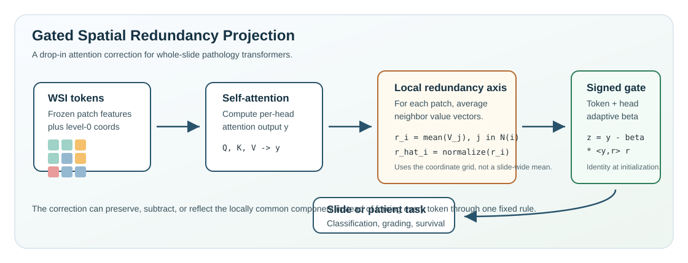
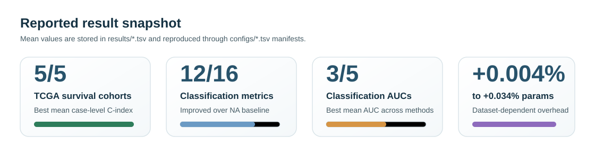

# GatedSRP: Local Redundancy-Aware Attention for Pathology Transformers


**Gated Spatial Redundancy Projection (Gated SRP)** is a lightweight attention
correction for whole-slide pathology transformers. It estimates the locally
common tissue direction around each patch token and gives the model a signed,
identity-initialized gate to subtract, preserve, or reflect that redundant
component.

<p align="center">
  
</p>

## Why This Exists

Whole-slide images are not natural images cut into independent tokens. Neighboring
patches often contain the same tissue type, stain, texture, and cellular
composition. Standard self-attention can repeatedly mix this local common signal
into token representations, which can weaken subtle diagnostic or prognostic
deviations.

Gated SRP keeps the base attention layer intact and adds one geometric correction:

```text
z_i = y_i - beta_i * <y_i, r_hat_i> * r_hat_i
```

`r_hat_i` is the normalized local neighborhood direction and `beta_i` is a
small learned signed gate. At initialization, `beta_i = 0`, so the module starts
as the original attention layer.

## What You Can Do With This Repo

| Goal | Start here |
|---|---|
| Understand the mechanism | [docs/METHOD.md](docs/METHOD.md) |
| Add Gated SRP to another transformer | [docs/INTEGRATION.md](docs/INTEGRATION.md) |
| Reproduce the reported tables | [docs/REPRODUCING.md](docs/REPRODUCING.md) |
| Prepare datasets and labels | [docs/DATASETS.md](docs/DATASETS.md) |
| Extract or validate H5 patch embeddings | [docs/EMBEDDINGS.md](docs/EMBEDDINGS.md) |
| Inspect reference numbers | [docs/RESULTS.md](docs/RESULTS.md) |

## Result Snapshot

<p align="center">
  
</p>

Reference tables are bundled in [results/](results). Exact run commands are
stored in [configs/](configs), so every reported number has a manifest row.

## Quick Start

Choose one environment path. PyTorch is installed explicitly so you can choose
the CUDA or CPU wheel that matches your machine.

### Conda

```bash
conda env create -f environment.yml
conda activate gatedsrp
python -m pip install torch torchvision --index-url https://download.pytorch.org/whl/cu124
python -m pip install -r requirements.txt
```

### venv + pip

```bash
python3.10 -m venv .venv
source .venv/bin/activate
python -m pip install --upgrade pip
python -m pip install torch torchvision --index-url https://download.pytorch.org/whl/cu124
python -m pip install -r requirements.txt
```

### uv

```bash
uv sync --python 3.10
uv pip install torch torchvision --index-url https://download.pytorch.org/whl/cu124
```

For CPU-only smoke tests, install the CPU PyTorch wheel instead.

## First Smoke Test

Prepare datasets and frozen H5 embeddings as described in
[docs/DATASETS.md](docs/DATASETS.md) and [docs/EMBEDDINGS.md](docs/EMBEDDINGS.md),
then set local paths:

```bash
source configs/paths.example.env
```

Preview one command without launching training:

```bash
python scripts/run_manifest.py configs/paper_classification.tsv \
  --where dataset=cam16 --where method=baseline --where seed=42 --dry-run
```

Run the lightweight tests:

```bash
python -m pytest tests -q
```

## Use Gated SRP in Your Own Model

For a TransMIL-style WSI aggregator:

```python
from slide_level_srp.src.srp_aggregator import NystromSRPAggregator

model = NystromSRPAggregator(
    in_dim=1536,
    embed_dim=384,
    depth=4,
    num_heads=6,
    num_classes=2,
    beta_patch_mode="signed_gated",
    srp_mode="post_agg_signed_gated",
    delta_scale=1.0,
    gate_hidden_dim=16,
)
```

For a dense ViT-style grid attention block, use
`src.srp_patch_attention.PatchSRPAttention`. See
[docs/INTEGRATION.md](docs/INTEGRATION.md) for the required neighbor graph,
`h_local` signal, and invariants for safe integration.

## Reproduce the Tables

Run the full manifests:

```bash
python scripts/run_manifest.py configs/paper_classification.tsv
python scripts/run_manifest.py configs/paper_tcga_survival.tsv
python scripts/run_manifest.py configs/paper_architecture_ablation.tsv
python scripts/run_manifest.py configs/paper_design_ablation.tsv
python scripts/run_manifest.py configs/paper_patch_encoder_ablation.tsv
```

Collect main-table rerun metrics:

```bash
python scripts/collect_paper_results.py --strict
```

## Repository Map

| Path | Purpose |
|---|---|
| `slide_level_srp/` | Gated SRP, Diff comparator, slide/TCGA trainers, and dataset adapters. |
| `slide_level/` | Baseline TransMIL/XSA components reused by the SRP trainer. |
| `patch_level_adp/` | ADP raw-RGB ViT trainer for the architecture-choice ablation. |
| `src/` | PANDA and ADP model/data helpers, full-softmax SRP attention, and comparators. |
| `examples/` | Minimal standalone snippets for calling Gated SRP modules. |
| `configs/` | Runnable manifests for main results and ablations. |
| `scripts/` | Manifest runner, H5 validator, embedding extraction template, and result collector. |
| `results/` | Reference result tables. |
| `docs/` | Method, integration, dataset, embedding, reproduction, and result details. |

## Reference Tables

- [classification_main_table.tsv](results/classification_main_table.tsv)
- [tcga_survival_main_table.tsv](results/tcga_survival_main_table.tsv)
- [ablation_architecture_choice.tsv](results/ablation_architecture_choice.tsv)
- [ablation_fixed_projection.tsv](results/ablation_fixed_projection.tsv)
- [ablation_gate_range.tsv](results/ablation_gate_range.tsv)
- [ablation_gate_gradients.tsv](results/ablation_gate_gradients.tsv)
- [ablation_gate_factorization.tsv](results/ablation_gate_factorization.tsv)
- [ablation_gate_initialization.tsv](results/ablation_gate_initialization.tsv)
- [ablation_patch_encoder.tsv](results/ablation_patch_encoder.tsv)

## Citation

Citation metadata will be added after publication details are available.

## License

This repository is released under Creative Commons Attribution-NonCommercial-ShareAlike 4.0 International. See [LICENSE](LICENSE).
