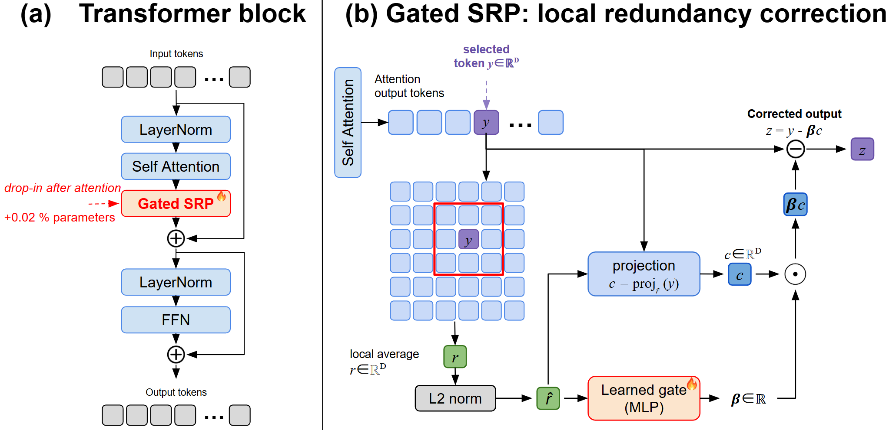
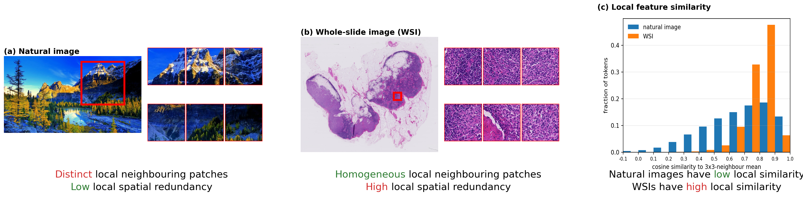
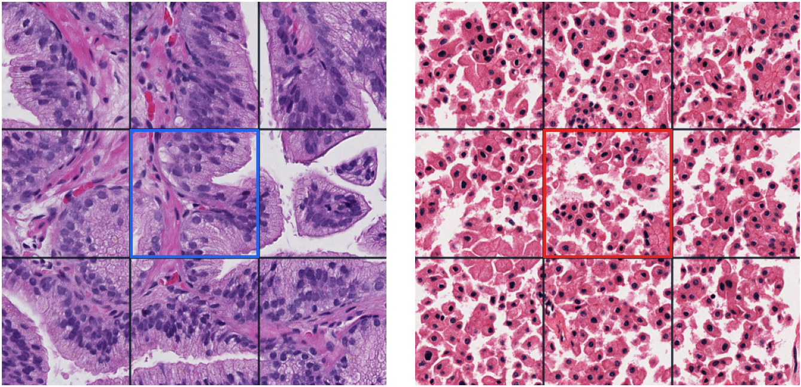

<h1 align="center">Gated Spatial Redundancy Projection for Pathology Transformer Attentions [BMVC 2026]</h1>

<p align="center">
  <a href="https://www.python.org/"></a>
  <a href="https://pytorch.org/"></a>
  <a href="LICENSE"></a>
</p>

<p align="center">
  <a href="https://atlasanalyticslab.github.io/GatedSRP/">Project website</a> ·
  <a href="https://arxiv.org/abs/2608.08374">Paper</a> ·
  <a href="docs/METHOD.md">Method</a> ·
  <a href="docs/INTEGRATION.md">Use in another model</a> ·
  <a href="docs/REPRODUCING.md">Reproduce results</a> ·
  <a href="docs/DATASETS.md">Data and embeddings</a>
</p>

Code for:

> **Gated Spatial Redundancy Projection for Pathology Transformer Attentions**
>
> Zhiyuan Yang, Jiahao Cheng, Vincent Quoc-Huy Trinh, Mahdi S. Hosseini
>
> Accepted at the British Machine Vision Conference (BMVC), 2026

**Gated Spatial Redundancy Projection (GatedSRP)** is a lightweight correction
for pathology transformers. It identifies the feature direction shared by a
patch and its spatial neighbors, then learns a signed token-and-head-specific
coefficient that decides whether attention should retain, remove, or reflect
that local component.

<p align="center">
  
</p>

## Why Local Redundancy Matters

Whole-slide image tokens are spatially structured. Adjacent patches often
repeat tissue type, stain, texture, and cell composition. Attention can keep
mixing this locally common signal while the small diagnostic or prognostic
deviations become harder to preserve.

GatedSRP leaves the attention operator intact and corrects each patch output:

```text
r_i     = mean of neighboring value vectors
r_hat_i = r_i / ||r_i||
z_i     = y_i - beta_i <y_i, r_hat_i> r_hat_i
```

The learned coefficient is signed and bounded. `beta=0` is identity,
`beta=1` removes the aligned component, `beta=2` reflects it, and negative
values reinforce local context. The gate is initialized at zero, so a model
starts exactly from its unmodified attention path.

<p align="center">
  
</p>

## Evidence at a Glance

All values below are means over seeds 42-46. Complete aggregate and per-seed
tables are in [results](results).

| Question | Result | Table |
|---|---|---|
| Does the correction help survival prediction? | Highest mean case C-index on all five evaluated TCGA cohorts; mean paired change `+0.0269`, 95% CI `[0.0148, 0.0389]`, `p=0.0035`. | [TCGA survival](results/survival_summary.tsv), [statistics](results/cross_dataset_statistics.tsv) |
| Does it help classification consistently? | Mean selected-metric change `+0.0108`; positive on 4/5 datasets and 12/16 classification metrics. | [classification](results/classification_summary.tsv), [dataset statistics](results/dataset_statistics.tsv) |
| Is it tied to one attention family? | Evaluated with Nystrom attention, dense MHSA, official SPAN, and Prov-GigaPath LongNet. Effects are mixed across families rather than uniformly positive. | [slide backbones](results/slide_backbones.tsv) |
| Is the local neighborhood important? | The `3x3` neighborhood has the best mean selected metric on all six evaluated tasks. | [neighborhood sizes](results/neighborhood_sizes.tsv) |
| Is dataset-selected gate range essential? | Direct `beta=2*tanh(g/2)` remains competitive, but the selected fixed range is better on 5/6 tasks. | [coefficient parameterizations](results/coefficient_parameterizations.tsv) |
| What does it cost? | PANDA peak reserved memory is `0.49 GiB`; mean TCGA peak reserved memory is `4.69 GiB` with the exact chunked correction. | [runtime efficiency](results/runtime_efficiency.tsv) |

<p align="center">
  
</p>

The learned behavior is not one universal phenotype: some slides remain near
identity, PANDA examples can be weakly negative, and KIRC examples can move
above projection strength. No evaluated checkpoint export had a mean
coefficient in the reflection bin above `1.5`; see
[coefficient_behavior.tsv](results/coefficient_behavior.tsv).

## Install

Choose one environment workflow. The pinned package versions match the
completed experiments. The CUDA commands use PyTorch 2.6.0 with CUDA 12.4;
use the CPU index instead on a CPU-only machine.

AtlasPatch also needs the native OpenSlide library. The Conda environment
installs it. On Ubuntu or Debian, install it before using venv or uv:

```bash
sudo apt-get install openslide-tools
```

CPU-only PyTorch installation:

```bash
python -m pip install torch==2.6.0 torchvision==0.21.0 \
  --index-url https://download.pytorch.org/whl/cpu
```

### Conda

```bash
conda env create -f environment.yml
conda activate gatedsrp
python -m pip install torch==2.6.0 torchvision==0.21.0 --index-url https://download.pytorch.org/whl/cu124
python -m pip install -r requirements.txt
python -m pip install --no-deps -e .
```

### venv + pip

```bash
python3.10 -m venv .venv
source .venv/bin/activate
python -m pip install --upgrade pip
python -m pip install torch==2.6.0 torchvision==0.21.0 --index-url https://download.pytorch.org/whl/cu124
python -m pip install -r requirements.txt
python -m pip install --no-deps -e .
```

### uv

```bash
python -m pip install uv
uv venv --python 3.10
source .venv/bin/activate
uv pip install torch==2.6.0 torchvision==0.21.0 --index-url https://download.pytorch.org/whl/cu124
uv pip install -r requirements.txt
uv pip install --no-deps -e .
```

Run the CPU-compatible test suite after installation:

```bash
python -m pytest tests -q
```

## From Slides to a Run

Raw slides and H5 embeddings may remain anywhere on your server. Configure
their absolute paths rather than copying large datasets into this repository:

```bash
cp configs/paths.example.env .env.local
source .env.local
```

1. Download the public datasets using [docs/DATASETS.md](docs/DATASETS.md).
2. Install AtlasPatch and generate one H5 embedding file per WSI:

```bash
python -m pip install atlas-patch
python -m pip install git+https://github.com/facebookresearch/sam2.git

python scripts/extract_atlaspatch_embeddings.py \
  --dataset camelyon17 \
  --input "$CAM17_RAW_ROOT" \
  --output "$(dirname "$CAM17_UNIV2_ROOT")"
```

3. Validate the feature key, dimensions, coordinates, and row alignment:

```bash
python scripts/validate_h5_embeddings.py \
  --root "$CAM17_UNIV2_ROOT" \
  --feature-key features/uni_v2 \
  --expected-dim 1536
```

4. Preview and run a single manifest row:

```bash
python scripts/run_manifest.py configs/classification_tasks.tsv \
  --where dataset=cam16 --where method=baseline --where seed=42 --dry-run

python scripts/run_manifest.py configs/classification_tasks.tsv \
  --where dataset=cam16 --where method=baseline --where seed=42
```

5. Strictly collect that same row and compare its TSV metrics with
   [results/](results/):

```bash
python scripts/collect_task_results.py \
  --where dataset=cam16 --where method=baseline --where seed=42 \
  --public-only --strict
```

TCGA is fully enumerated by the checked-in OS label table. The helper either
downloads the exact GDC slide set or stages slides already present elsewhere:

```bash
bash scripts/download_tcga_slides.sh

TCGA_EXISTING_SLIDE_DIRS=/shared/gdc/tcga-slides \
  bash scripts/download_tcga_slides.sh
```

See [docs/EMBEDDINGS.md](docs/EMBEDDINGS.md) for every dataset-specific
AtlasPatch command and H5 layout. KGH is a restricted cohort: its loader and
manifest rows are retained, but no KGH labels, slides, or embeddings are
distributed.

## Reproduce Every Evaluation

```bash
# Prediction tasks
python scripts/run_manifest.py configs/classification_tasks.tsv --where access=public
python scripts/run_manifest.py configs/survival_tasks.tsv --where access=public

# Attention, slide backbones, MIL models, and patch representations
python scripts/run_manifest.py configs/attention_operators.tsv --where access=public
python scripts/run_manifest.py configs/slide_backbones.tsv --where access=public
python scripts/run_manifest.py configs/mil_models.tsv --where access=public
python scripts/run_manifest.py configs/patch_encoders.tsv --where access=public

# GatedSRP components and spatial design
python scripts/run_manifest.py configs/component_variants.tsv --where access=public
python scripts/run_manifest.py configs/neighborhood_sizes.tsv --where access=public
python scripts/run_manifest.py configs/coefficient_parameterizations.tsv --where access=public

# Runtime and memory
python scripts/run_manifest.py configs/runtime_efficiency.tsv --where access=public
```

Authorized KGH users can omit `--where access=public` from manifests containing
restricted rows.

Official SPAN and Prov-GigaPath LongNet rows require optional checkouts and
their native dependencies:

```bash
bash scripts/setup_optional_architectures.sh
```

Collect task and typed-comparison outputs:

```bash
python scripts/collect_task_results.py --public-only --strict

python scripts/collect_comparison_results.py configs/neighborhood_sizes.tsv \
  --run-root "${GATEDSRP_NEIGHBORHOOD_OUT:-runs/neighborhood_sizes}" \
  --public-only --strict
```

The complete run matrix, expected artifacts, output roots, and compute notes
are documented in [docs/REPRODUCING.md](docs/REPRODUCING.md).

## Add GatedSRP to Another Model

The portable integration point is a post-attention patch-token hook. Existing
attention, positional encoding, and readout stay in place.

```python
from slide_level_srp.src.srp_correction import PatchSRPCorrection

srp = PatchSRPCorrection(
    768,
    hidden_dim=32,
    delta_scale=2.0,
)

# y: (B, N, D), containing patch-token attention updates
z = srp(
    y,
    neighbor_index,
    neighbor_mask,
    neighbor_weight=neighbor_weight,
)
```

For a ready TransMIL-style model, use
`slide_level_srp.src.srp_aggregator.NystromSRPAggregator`. For dense MHSA,
SPAN, LongNet, and custom architectures, see
[docs/INTEGRATION.md](docs/INTEGRATION.md) and
[docs/ARCHITECTURES.md](docs/ARCHITECTURES.md).

## Repository Map

| Path | Purpose |
|---|---|
| `slide_level_srp/` | Slide-level attention, GatedSRP gate, scalable correction, baselines, trainers, and data adapters. |
| `slide_level/` | Shared Nyström/TransMIL components. |
| `patch_level_adp/` | Raw-RGB ADP patch trainer used for the attention-operator comparison. |
| `src/` | PANDA/ADP helpers and fixed-grid attention modules. |
| `configs/` | Explicit five-seed command manifests for every released evaluation. |
| `data/labels/` | Redistributable labels used by public datasets; KGH is excluded. |
| `scripts/` | Dataset download, AtlasPatch extraction, validation, execution, and result collection. |
| `results/` | Aggregate and per-seed reference tables. |
| `website/` | Static project site suitable for GitHub Pages. |

## Checkpoints

No pretrained slide checkpoint or GatedSRP-specific pretraining is required.
The manifests train each task model and write `best.pt` locally. Shipping every
seed checkpoint in Git would be unnecessarily large; the policy and artifact
locations are described in [docs/CHECKPOINTS.md](docs/CHECKPOINTS.md).

## Citation

GatedSRP was accepted at the British Machine Vision Conference (BMVC) 2026.
Until the proceedings record is available, please cite the released arXiv
paper:

```bibtex
@misc{yang2026gatedspatialredundancyprojection,
      title={Gated Spatial Redundancy Projection for Pathology Transformer Attentions},
      author={Zhiyuan Yang and Jiahao Cheng and Vincent Quoc-Huy Trinh and Mahdi S. Hosseini},
      year={2026},
      eprint={2608.08374},
      archivePrefix={arXiv},
      primaryClass={cs.CV},
      url={https://arxiv.org/abs/2608.08374}
}
```

## License

This repository is available under the
[Creative Commons Attribution-NonCommercial-ShareAlike 4.0 International](LICENSE)
license.
